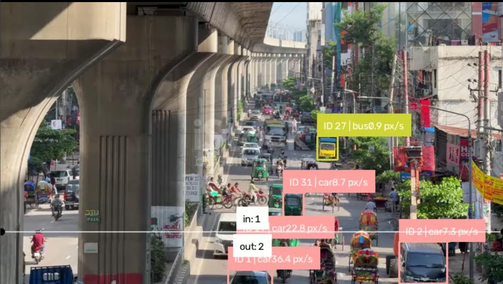
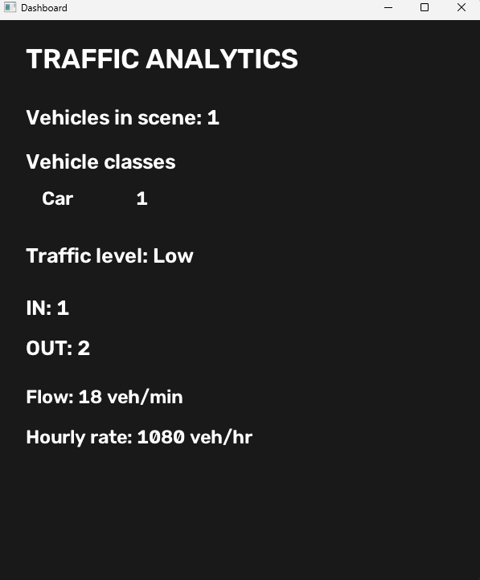
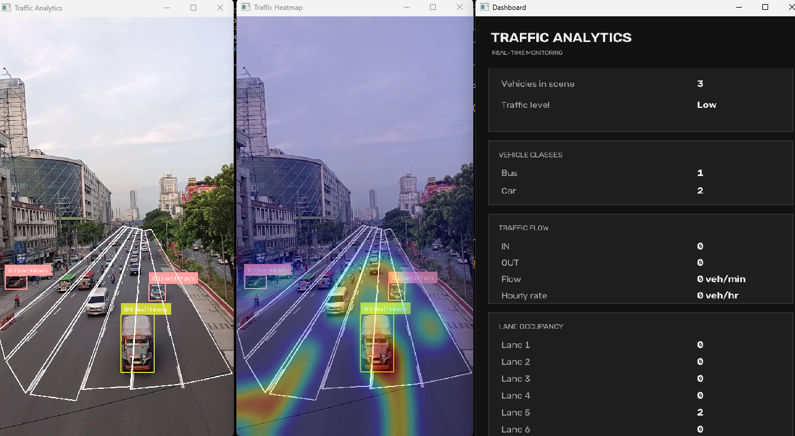

# Real-Time Traffic Analytics

A computer vision project for analyzing road traffic from video using YOLO, ByteTrack, OpenCV, and Supervision.

The project is being developed step by step. The current system can detect and track vehicles, count vehicles crossing a line, estimate traffic flow and relative speed, analyze lane occupancy, generate a traffic heatmap, and display the results in a separate dashboard.

## Current Features

- Vehicle detection using YOLO
- Multi-object tracking using ByteTrack
- Vehicle ID and class labels
- IN/OUT line crossing count
- Vehicle class statistics
- Traffic congestion estimation
- Traffic flow estimation
- Relative vehicle speed estimation in `px/s`
- Lane-wise vehicle occupancy
- Traffic movement heatmap
- Separate real-time analytics dashboard

---

## Project Structure

```text
real-time-traffic-analytics/
├── assets/
│   ├── traffic-analysis-demo.png
│   ├── dashboard.png
│   └── traffic-analytics-system.png
│
├── app/
│   ├── analytics/
│   │   ├── congestion.py
│   │   ├── dashboard.py
│   │   ├── flow.py
│   │   ├── heatmap.py
│   │   ├── lane_analyzer.py
│   │   ├── line_counter.py
│   │   └── speed_estimator.py
│   │
│   ├── detection/
│   │   └── yolo_detector.py
│   │
│   ├── tracking/
│   │   └── byte_tracker.py
│   │
│   ├── utils/
│   │   └── config_loader.py
│   │
│   └── video_processor.py
│
├── main.py
├── requirements.txt
└── README.md
```

---

## 1. Vehicle Detection

The detection module uses YOLO to detect vehicles in each video frame.

For the standard COCO model, the project currently uses common traffic classes such as:

```text
2 = car
3 = motorcycle
5 = bus
7 = truck
```

File:

```text
app/detection/yolo_detector.py
```

---

## 2. Vehicle Tracking

ByteTrack is used to track detected vehicles across video frames.

Each tracked vehicle receives a persistent ID:

```text
ID 12 | car
ID 18 | motorcycle
ID 25 | bus
```

Tracking is required for line counting, traffic flow, speed estimation, and other vehicle-level analytics.

File:

```text
app/tracking/byte_tracker.py
```

---

## 3. Line Crossing

A configurable line is placed across the road using Supervision's `LineZone`.

When a tracked vehicle crosses the line, the system updates:

```text
IN
OUT
```

File:

```text
app/analytics/line_counter.py
```

### Detection, Tracking, and Line Counting

<p align="center">
  
</p>

---

## 4. Traffic Congestion

The current congestion module estimates the traffic level using the number of vehicles visible in the scene.

```text
0-10 vehicles   -> Low
11-20 vehicles  -> Medium
21+ vehicles    -> High
```

The current levels are:

```text
Low
Medium
High
```

File:

```text
app/analytics/congestion.py
```

This is currently a simple rule-based method and can be improved later using lane occupancy, vehicle speed, and road occupancy.

---

## 5. Traffic Flow

Traffic flow is calculated using vehicle line-crossing events and video time.

The system calculates:

```text
vehicles per minute
vehicles per hour
```

Example:

```text
Flow: 12 veh/min
Hourly rate: 720 veh/hr
```

File:

```text
app/analytics/flow.py
```

---

## 6. Relative Speed Estimation

The system estimates vehicle movement using the change in a tracked vehicle's position between frames.

```text
Relative speed =
Pixel distance travelled / Elapsed video time
```

The result is displayed in:

```text
px/s
```

Example:

```text
ID 12 | car | 184.3 px/s
```

File:

```text
app/analytics/speed_estimator.py
```

This is a relative image-space speed and is not the actual vehicle speed in `km/h`.

---

## 7. Traffic Dashboard

The dashboard displays the current traffic statistics in a separate OpenCV window.

It currently shows:

- Vehicles in the scene
- Vehicle counts by class
- Traffic congestion level
- IN and OUT counts
- Vehicles per minute
- Estimated vehicles per hour
- Lane occupancy

File:

```text
app/analytics/dashboard.py
```

### Dashboard


<table>
  <tr>
    <td width="70%" align="center">
      
    </td>
    <td width="30%" align="center">
      
    </td>
  </tr>
</table>

Keeping the dashboard separate from the main traffic video prevents analytics information from covering the video.

---

## 8. Lane-Wise Analytics

The road is divided into manually defined polygon regions representing individual lanes.

For each detected vehicle, the system uses the bottom-center point of its bounding box to determine which lane contains the vehicle.

```text
Vehicle
   |
   v
Bottom-center point
   |
   v
Lane polygon check
   |
   v
Lane 1 / Lane 2 / Lane 3 / ...
```

The current system displays the number of vehicles occupying each lane.

Example:

```text
Lane 1: 0
Lane 2: 1
Lane 3: 2
Lane 4: 1
Lane 5: 0
Lane 6: 0
```

File:

```text
app/analytics/lane_analyzer.py
```

---

## 9. Traffic Heatmap

The heatmap records vehicle positions over time and highlights the areas of the road with the most vehicle movement.

The system:

```text
Tracks vehicle positions
        |
        v
Accumulates movement points
        |
        v
Applies smoothing
        |
        v
Creates a traffic heatmap
```

File:

```text
app/analytics/heatmap.py
```

### Lane Analysis, Heatmap, and Updated Dashboard

<p align="center">
  
</p>

The current application uses three separate windows:

- **Traffic Analytics** — vehicle detection, tracking, speed, line counting, and lane regions
- **Traffic Heatmap** — accumulated vehicle movement patterns
- **Dashboard** — real-time traffic statistics and lane occupancy

---

## 10. Video Processing

The `VideoProcessor` connects all parts of the system.

For every video frame, it:

```text
Reads video frame
        |
        v
Detects vehicles
        |
        v
Tracks vehicles
        |
        +----------------------+
        |                      |
        v                      v
Traffic Analytics        Heatmap Update
        |
        v
Dashboard Update
        |
        v
Display and Save Output
```

File:

```text
app/video_processor.py
```

---

## Running the Project

Install the required dependencies:

```bash
pip install -r requirements.txt
```

Then run:

```bash
python main.py
```

Press `q` to stop processing.

---

## Current Limitations

- The standard COCO model does not contain Bangladesh-specific vehicle classes such as rickshaw and CNG/auto-rickshaw.
- Congestion estimation currently uses simple vehicle-count thresholds.
- Relative speed is measured in `px/s`, not `km/h`.
- Camera perspective affects pixel-based speed estimation.
- Lane polygons are manually configured for a specific camera view.
- Detection and tracking quality depend on the YOLO model and video conditions.

---

## Planned Improvements

- Fine-tune a Bangladesh-specific traffic detection model
- Detect rickshaw, CNG/auto-rickshaw, minibus, and other local vehicle types
- Smooth relative speed estimation
- Add calibrated real-world speed estimation in `km/h`
- Improve congestion estimation using lane occupancy and speed
- Save traffic analytics for historical analysis
- Build a professional desktop or web monitoring interface

---

## Technologies

- Python
- OpenCV
- Ultralytics YOLO
- ByteTrack
- Supervision
- NumPy

---

## Status

This project is under active development. The current version provides a modular foundation for a real-time intelligent traffic monitoring system.